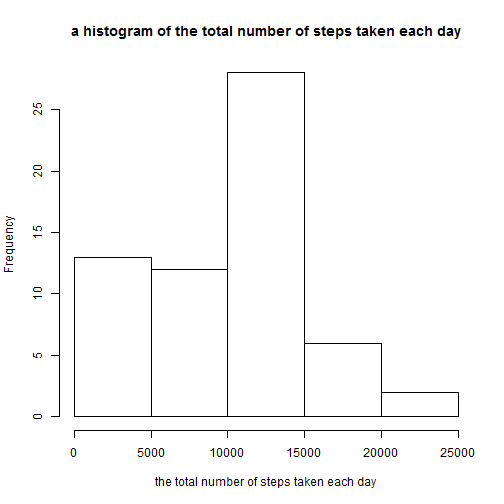
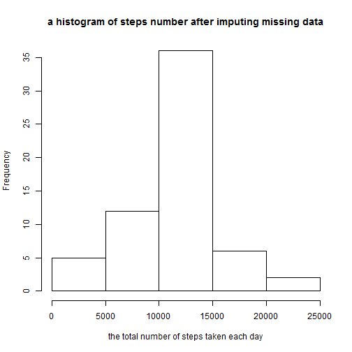

###Loading and preprocessing the data


```r
data<-read.csv("./activity.csv")
```

###What is mean total number of steps taken per day?
Make a histogram of the total number of steps taken each day

```r
sumStep<-aggregate(data$steps,by=list(data$date),sum,na.rm=TRUE)
hist(sumStep$x,xlab="the total number of steps taken each day",
     main="a histogram of the total number of steps taken each day")
```

 

Calculate and report the mean and median total number of steps taken per day

```r
mean(sumStep$x)
```

```
## [1] 9354.23
```

```r
median(sumStep$x)
```

```
## [1] 10395
```

###What is the average daily activity pattern?
Make a time series plot (i.e. type = "l") of the 5-minute interval (x-axis) and the average number of steps taken, averaged across all days (y-axis)

```r
meanDaily<-aggregate(data$steps,by=list(data$interval),mean,na.rm=TRUE)
plot(meanDaily$Group.1,meanDaily$x,type="l",xlab="interval",ylab="steps")
```

 

Which 5-minute interval, on average across all the days in the dataset, contains the maximum number of steps?

```r
meanDaily$Group.1[meanDaily$x==max(meanDaily$x)]
```

```
## [1] 835
```

###Imputing missing values
Calculate and report the total number of missing values in the dataset (i.e. the total number of rows with NAs)

```r
sum(is.na(data$steps))
```

```
## [1] 2304
```

Devise a strategy for filling in all of the missing values in the dataset. The strategy does not need to be sophisticated. For example, you could use the mean/median for that day, or the mean for that 5-minute interval, etc.
Create a new dataset that is equal to the original dataset but with the missing data filled in.

```r
dataCopy<-data
for(i in 1:length(data$steps)){
        if(is.na(data$steps[i])){
                dataCopy$steps[i]<-meanDaily$x[meanDaily$Group.1==data$interval[i]]
        }
}
```

Make a histogram of the total number of steps taken each day and Calculate and report the mean and median total number of steps taken per day.

```r
sumStep1<-aggregate(dataCopy$steps,by=list(dataCopy$date),sum,na.rm=TRUE)
hist(sumStep1$x,xlab="the total number of steps taken each day",
     main="a histogram of steps number after imputing missing data")
```

 

Do these values differ from the estimates from the first part of the assignment? What is the impact of imputing missing data on the estimates of the total daily number of steps?
-yes,they are different,the mean and the median of the data increases.

```r
mean(sumStep1$x)
```

```
## [1] 10766.19
```

```r
median(sumStep1$x)
```

```
## [1] 10766.19
```

##Are there differences in activity patterns between weekdays and weekends?
Create a new factor variable in the dataset with two levels -- "weekday" and "weekend" indicating whether a given date is a weekday or weekend day.

```r
day<-weekdays(as.Date(dataCopy$date))
weekday<-day
for(i in 1:length(day)){
        if(day[i]=="ÐÇÆÚÁù"||day[i]=="ÐÇÆÚÈÕ"){
                weekday[i]<-"weekend" 
        }
        else{
                weekday[i]<-"weekday" 
        }
}
dataCopy<-cbind(dataCopy,weekday=as.factor(weekday))
```

Make a panel plot containing a time series plot (i.e. type = "l") of the 5-minute interval (x-axis) and the average number of steps taken, averaged across all weekday days or weekend days (y-axis).

```r
library(ggplot2)
meanDaily1<-aggregate(dataCopy$steps,
                      by=list(interval=dataCopy$interval,weekday=dataCopy$weekday),
                      mean,na.rm=TRUE)
qplot(x=interval,y=x,data=meanDaily1,geom="path",facets=weekday~.,
      xlab="Interval",ylab="Number of steps")
```

 
